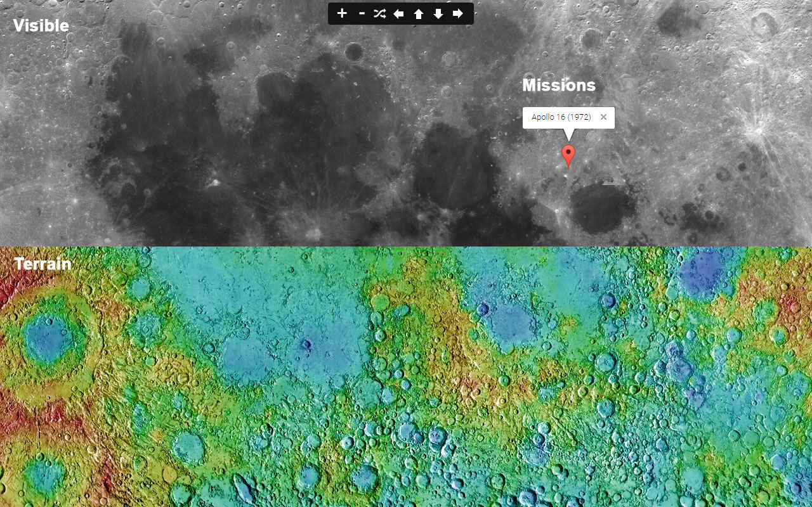
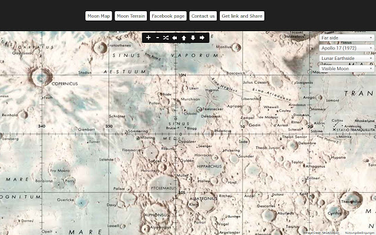
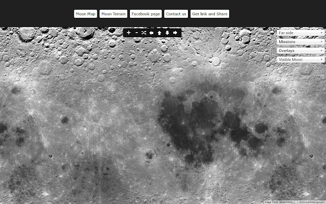
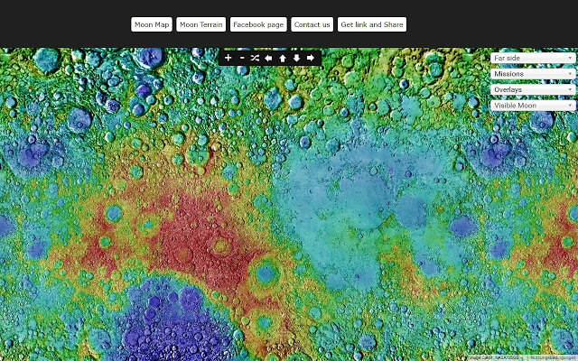
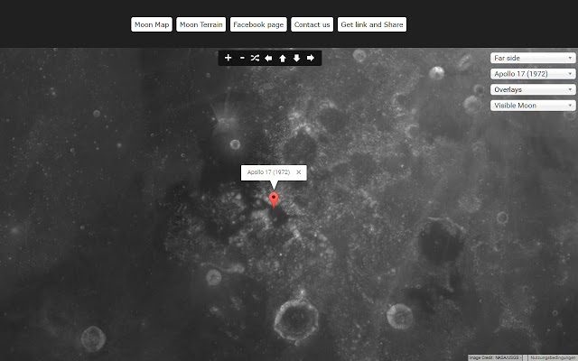

# moon.luhui.net

鲁虺月球地图 luhui moon map

# http://moon.luhui.net

演示地址

http://yueliang.luhui.net

http://yueqiu.guanfu.org/

http://yueqiu.luhui.net

http://yueqiu.netlify.app

申请谷歌api改第17行的域名所属api

修改buttons.js第11行

 
 
#  Status badges状态徽章
Netlify badges for your site您网站的Netlify徽章

Deploy status badge部署状态徽章

This image automatically updates to reflect the current state of your latest production deploy. You can use the markdown snippet below to add it to your project README.
该映像会自动更新以反映最新生产部署的当前状态。您可以使用下面的markdown代码片段将其添加到您的项目README中。

# 鲁虺月球地图使用谷歌地球插件这三维月球 atlas 探索月球。 

鲁虺月球地图可以查看阿波罗任务，火山口，表面，月相。

 

# 鲁虺月球三维地图允许您查看月球景观以新的方式。

鲁虺月球地图在这个项目中使用了谷歌地球 API。谷歌地球插件允许您浏览和探索月球地理数据在使用 web 浏览器的 3D 球体上。

# 鲁虺月球三维地图轻松导航。

鲁虺月球三维地图使用新的导航面板可放大和缩小、 旋转左或向右，使 360 ° 旋转视图，倾斜地球的地图或只是按随机按钮以找到一个新的令人惊奇的地方。
 

# 鲁虺月球三维地图相机控制。

在鲁虺月球三维地图你可以调整摄像机的位置，在高度、 旋转和倾斜。

# 鲁虺月球三维地图搜索。

在鲁虺月球三维地图键入任意坐标-一个地方的经度和纬度。

# 鲁虺月球三维地图新的有趣的地方在地图上。
 
鲁虺月球三维地图下拉菜单中的有趣的地方列表将帮助您找到他们在哪里。

鲁虺月球三维地图仍然到来是受欢迎的地方、 山峦、 着陆点、 阿波罗登月计划和更多的列表。

鲁虺月球三维地图如果该插件不正常工作与铬，请参阅铬帮助中心，了解如何更新到最新版本。

月亮是地球，总是伴随着黑暗的火山玛利亚那明亮的古代地壳高地和突出的撞击坑之间填满其近侧显示同一张脸的同步旋转。

它是在地球的天空 （后太阳），作为衡量照度对地球表面的中第二亮经常可见的天体。

虽然它可以出现非常明亮的白色，它的表面是实际上是黑暗的只是略高于破损沥青反射率。

其突出在天空和其常会周期内阶段，从古至今，作月亮语言、 日历、 艺术和神话中重要的文化影响。

月亮的引力影响产生海洋的潮汐和轻微延长一天。

 
月球的当前轨道距离是大约三十倍地球，使它有明显的大小在天空中的太阳几乎相同的直径。

这使得月球遮住了太阳近正是在日全食。此匹配明显视觉尺寸是一个巧合。

（来源： 维基百科 http://en.wikipedia.org/wiki/Moon)

地球插件要求： 微软视窗 (Windows XP、 Windows Vista 和 Windows 7) 或苹果 Mac OS X 10.6 或更高版本 （任何英特尔 Mac）。
